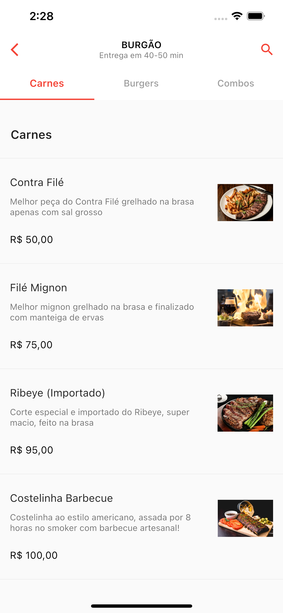

# iFood Scroll List Demo

Um exemplo para simular a lista de pratos / comidas / items de um estabelecimento do app do iFood. 
A ideia é possibilitar o scroll de forma programática até uma categoria que não está visível. 
Também, quando o usuário rolar a tela, adicionar um `listener` para alterar automaticamente qual `tab` está ativa.

## Package alternativo

- [Lab: Write your first Flutter app](https://flutter.dev/docs/get-started/codelab)
- [Cookbook: Useful Flutter samples](https://flutter.dev/docs/cookbook)

