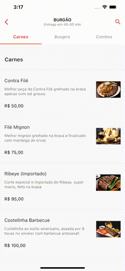

# iFood Scroll List Demo

Um exemplo para simular a lista de pratos / comidas / items de um estabelecimento do app do iFood. 
A ideia é possibilitar o scroll de forma programática até uma categoria que não está visível. 
Também, quando o usuário rolar a tela, adicionar um `listener` para alterar automaticamente a `tab` que está ativa.

## Package alternativo

- [Scrollable Positioned List](https://pub.dev/packages/scrollable_positioned_list)

